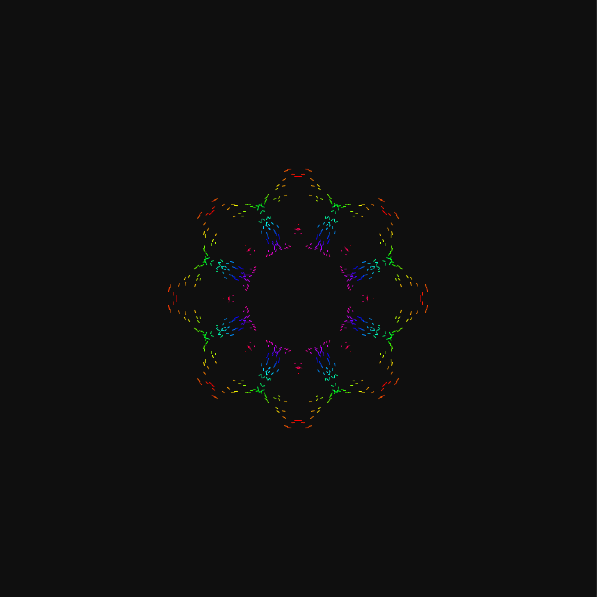

# CCC-SummerCamp-2018
総合コンテンツ製作サークルで作成した、オーディオビジュアライザ  

  
## 実行方法
audioVisualizer/data ディレクトリを作成し、音声ファイルを下記の箇所に指定して実行  
```processing:audioVisualizer.pde
void setup()
{
  size(800, 800);
  colorMode(HSB, 255);
  frameRate(60);
  
  spec.init(this, "ここに音声ファイル名");
}
```

## 共同製作メンバー

- Kuyuri Iroha -[@kuyuri_iroha](https://twitter.com/kuyuri_iroha)
- さいとー -[@oshakusomegane](https://twitter.com/oshakusomegane)
- ちゃんふり -[@May_ple_T](https://twitter.com/May_ple_T)

# 参考

- [BGMの周波数を分析する（minim編）](https://goo.gl/yYstJ2) 


# LICENCE
[MIT License](LICENSE)
